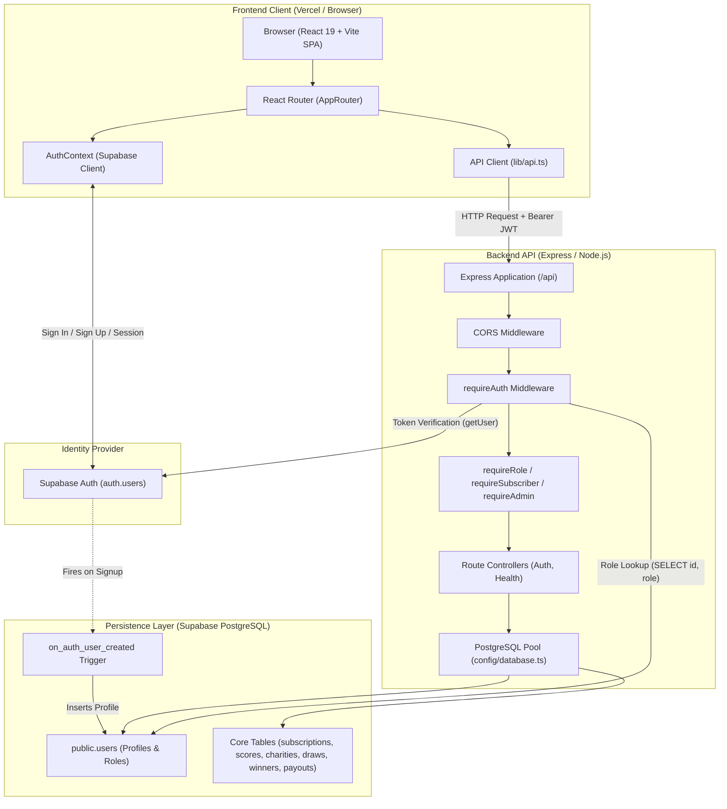
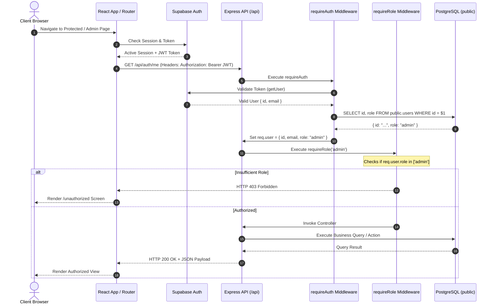

# Digital Hero — System Architecture

This document details the software architecture, component relationships, request lifecycles, and security boundaries of the Digital Hero application.

---

## 1. Architecture Overview

Digital Hero is a full-stack TypeScript application consisting of a React Single-Page Application (SPA), a decoupled Express REST API backend, and Supabase managed services (PostgreSQL and Supabase Auth).

---

## 2. Frontend Architecture

* **Framework**: React 19 bootstrapped with Vite 8.
* **Language**: TypeScript with strict typing.
* **Styling**: TailwindCSS 4 via `@tailwindcss/vite`.
* **Routing**: React Router (`react-router-dom` v7).
  * Centralized route constants in [`client/src/constants/routes.ts`](file:///d:/shivam/projects/dgital-hero/client/src/constants/routes.ts).
  * Centralized router setup in [`client/src/app/AppRouter.tsx`](file:///d:/shivam/projects/dgital-hero/client/src/app/AppRouter.tsx).
* **Layouts**:
  * [`AppLayout`](file:///d:/shivam/projects/dgital-hero/client/src/layouts/AppLayout.tsx): Global wrapper featuring standard Header, main container, and Footer.
  * [`AdminLayout`](file:///d:/shivam/projects/dgital-hero/client/src/layouts/AdminLayout.tsx): Sidebar navigation layout dedicated to administrative portals.
* **Route Guards**:
  * [`ProtectedRoute`](file:///d:/shivam/projects/dgital-hero/client/src/components/routing/ProtectedRoute.tsx): Enforces user authentication; redirects unauthenticated visitors to `/login` preserving target location.
  * [`RoleRoute`](file:///d:/shivam/projects/dgital-hero/client/src/components/routing/RoleRoute.tsx): Restricts access to specified roles (`visitor`, `subscriber`, `admin`); redirects unauthorized users to `/unauthorized`.
* **State Management**:
  * [`AuthContext`](file:///d:/shivam/projects/dgital-hero/client/src/context/AuthContext.tsx): Manages user session, profile hydration from `public.users`, role state, signup, login, and logout.
* **API Client**:
  * [`client/src/lib/api.ts`](file:///d:/shivam/projects/dgital-hero/client/src/lib/api.ts): Lightweight wrapper around standard `fetch`. Automatically injects `Authorization: Bearer <token>` using the current Supabase session.

---

## 3. Backend Architecture

* **Runtime**: Node.js with TypeScript (`tsx` for dev, `tsc` for production build).
* **HTTP Framework**: Express 4.
* **Pattern**: Route -> Middleware -> Controller -> Database Access.
* **Entrypoints**:
  * Standalone Server: [`server/src/server.ts`](file:///d:/shivam/projects/dgital-hero/server/src/server.ts) (`npm start` -> `node dist/server.js`).
  * Serverless Function: [`server/api/index.ts`](file:///d:/shivam/projects/dgital-hero/server/api/index.ts) (exports Express app with dual ESM/CJS compatibility).
* **Database Connection**:
  * Native PostgreSQL connection pooling using `pg.Pool` in [`server/src/config/database.ts`](file:///d:/shivam/projects/dgital-hero/server/src/config/database.ts).
  * Privileged Supabase Client initialized with `SUPABASE_SECRET_KEY` in [`server/src/config/supabase.ts`](file:///d:/shivam/projects/dgital-hero/server/src/config/supabase.ts).
* **Graceful Shutdown**: Intercepts `SIGTERM` and `SIGINT` to drain database pool connections and close HTTP listeners cleanly.

---

## 4. Database Architecture

* **Platform**: Supabase PostgreSQL.
* **Schema Management**: Version-controlled SQL migrations located in [`supabase/migrations/`](file:///d:/shivam/projects/dgital-hero/supabase/migrations/).
* **Primary Key Strategy**: UUID (`gen_random_uuid()`) on all primary keys.
* **Temporal Strategy**: `created_at` and `updated_at` with `TIMESTAMPTZ DEFAULT now()`. Soft-delete support via `deleted_at TIMESTAMPTZ`.
* **Financial Precision**: All monetary values use `NUMERIC(12,2)`. Currencies use `CHAR(3)` defaulting to `'INR'`.
* **Data Invariants**:
  * Case-insensitive email uniqueness via functional index `LOWER(email)`.
  * One score per user per calendar day (`UNIQUE(user_id, score_date)`).
  * One draw entry per user per draw (`UNIQUE(user_id, draw_id)`).
  * Unique winner ranking per draw (`UNIQUE(draw_id, rank)`).
  * Unique winning user per draw (`UNIQUE(draw_id, user_id)`).
  * Single active subscription per user via partial index (`WHERE status = 'active'`).

---

## 5. Authentication Architecture

* **Authentication Authority**: Supabase Auth (`auth.users`).
* **Credentials Storage**: User passwords are encrypted (bcrypt) inside Supabase Auth. **Zero passwords are stored in `public.users`.**
* **Identity Synchronization**:
  * When a user signs up through Supabase Auth, the PostgreSQL trigger function `handle_new_user()` automatically creates a corresponding profile row in `public.users`.
  * The user is automatically assigned the baseline role: `'visitor'`.
  * Role escalation through registration metadata is strictly ignored by the trigger.

---

## 6. Authorization Architecture (RBAC)

The application enforces a 3-tier Role-Based Access Control model:

1. **`visitor`**: Baseline registered user or non-paying participant.
2. **`subscriber`**: Paying member with an active recurring subscription.
3. **`admin`**: System operator with full managerial privileges.

### Authorization Middleware Pipeline
* [`requireAuth`](file:///d:/shivam/projects/dgital-hero/server/src/middleware/auth.middleware.ts):
  1. Extracts `Bearer <token>` from incoming `Authorization` header. Returns `401 Unauthorized` if absent.
  2. Verifies token cryptographically with Supabase Auth API (`supabase.auth.getUser(token)`). Returns `401 Unauthorized` if invalid/expired.
  3. Queries `public.users` for the authoritative role assigned to `authUser.id`.
  4. Populates `req.user` with `{ id, email, name, role }`.
* [`requireRole(...roles)`](file:///d:/shivam/projects/dgital-hero/server/src/middleware/role.middleware.ts):
  1. Inspects `req.user.role`.
  2. If the user's role is not included in the allowed roles list, halts request with `403 Forbidden` (`Insufficient permissions`).
  3. Otherwise invokes `next()`.
* Helpers:
  * `requireSubscriber`: Permitted roles: `['subscriber', 'admin']`.
  * `requireAdmin`: Permitted roles: `['admin']`.

---

## 7. Request Lifecycle

---

## 8. Environment & Configuration Architecture

* Centralized validation modules on both client and server prevent runtime crashes caused by missing configuration:
  * Server: [`server/src/config/env.ts`](file:///d:/shivam/projects/dgital-hero/server/src/config/env.ts)
  * Client: [`client/src/config/env.ts`](file:///d:/shivam/projects/dgital-hero/client/src/config/env.ts)
* Separation of Concerns:
  * Client configuration only exposes public `VITE_*` keys.
  * Backend secrets (`SUPABASE_SECRET_KEY`, `DATABASE_URL`) never cross to client bundles.

---

## 9. Deployment Architecture

* **Frontend**: Deployed to Vercel as a Vite Single Page Application.
  * Root Directory: `client`
  * SPA rewrite configuration in [`client/vercel.json`](file:///d:/shivam/projects/dgital-hero/client/vercel.json) rewrites `/(.*)` to `/index.html` to prevent 404s on browser reload.
* **Backend**:
  * Vercel Serverless Function via [`server/api/index.ts`](file:///d:/shivam/projects/dgital-hero/server/api/index.ts) + [`server/vercel.json`](file:///d:/shivam/projects/dgital-hero/server/vercel.json).
  * Or persistent container/VM host via `npm start` (`node dist/server.js`).
  * Server detects `process.env.VERCEL` to suppress `httpServer.listen(...)` during serverless function execution.
* **CORS**:
  * Origin isolation based on `CLIENT_URL`.
  * Wildcards (`*`) are disabled in production.

---

## 10. Security Boundaries

1. **Frontend Route Guards are for UX**: Client-side redirection (`ProtectedRoute`, `RoleRoute`) enhances user experience by preventing navigation to forbidden pages. However, the client is untrusted.
2. **Backend RBAC is the Authoritative Gate**: Every protected API route independently verifies the Supabase token and looks up the role directly from `public.users`.
3. **Database Constraints are Invariants**: Integrity constraints (uniqueness, foreign keys with `ON DELETE RESTRICT`, positive monetary values, non-overlapping dates) enforce business safety at the relational engine level.
4. **No Service Keys in Frontend**: `SUPABASE_SECRET_KEY` and `DATABASE_URL` exist exclusively on the server.
