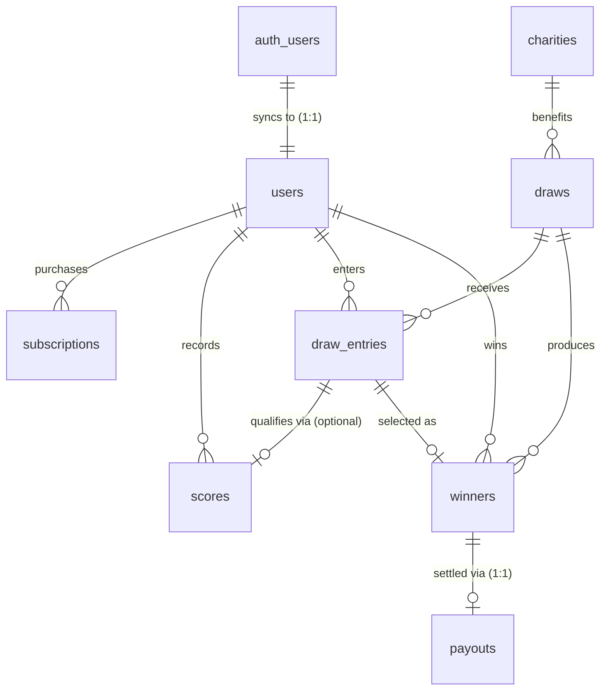

# Digital Hero — Database Architecture & Specification

This document details the PostgreSQL schema, relational strategies, integrity constraints, and deletion behaviors for the Digital Hero application.

---

## 1. Core Schema Principles & Strategies

1. **UUID Primary Key Strategy**: Every table utilizes a UUID primary key generated via `gen_random_uuid()` (or matching `auth.users(id)` for `public.users`). This avoids sequential ID predictability and simplifies distributed data operations.
2. **Temporal Audit Strategy**: Every table maintains `created_at TIMESTAMPTZ NOT NULL DEFAULT now()` and `updated_at TIMESTAMPTZ NOT NULL DEFAULT now()`. A dedicated trigger function `set_updated_at()` automatically keeps `updated_at` synchronized on modification.
3. **Monetary Precision Strategy**: All monetary columns (`prize_amount`, `amount`) are defined as `NUMERIC(12,2)`. Floating-point types are strictly forbidden to avoid rounding errors.
4. **Currency Default**: All currency representations are stored as uppercase 3-letter ISO-4217 codes (`CHAR(3)`), defaulting to `'INR'`.
5. **Role & Status Strategy**: State and role columns are defined as `TEXT` with strict `CHECK` constraints (e.g. `role IN ('visitor', 'subscriber', 'admin')`). This avoids Postgres `ENUM` locking issues when adding future states.
6. **Soft Deletion & Historical Integrity**: Core entities (`users`, `charities`) support soft-deletion via `deleted_at TIMESTAMPTZ`. Financial and audit records (`draw_entries`, `winners`, `payouts`) employ `ON DELETE RESTRICT` on user references to prevent accidental destruction of audit trails.
7. **Supabase Auth Integration**: `public.users.id` references `auth.users(id) ON DELETE CASCADE`. Authentication passwords and tokens are never stored in `public.users`.

---

## 2. Business Relationships



---

## 3. Table Specifications

### 3.1. `users`
Represents application-level user profiles and roles linked 1:1 with Supabase Auth.

* **Primary Key**: `id UUID PRIMARY KEY REFERENCES auth.users(id) ON DELETE CASCADE`
* **Important Columns**:
  * `email TEXT NOT NULL`: Unique via case-insensitive index `LOWER(email)`.
  * `name TEXT NOT NULL`: User display name (`CHECK (char_length(trim(name)) > 0)`).
  * `role TEXT NOT NULL DEFAULT 'visitor'`: Enforced via `CHECK (role IN ('visitor', 'subscriber', 'admin'))`.
  * `deleted_at TIMESTAMPTZ NULL`: Soft deletion timestamp.
* **Delete Behavior**: `CASCADE` from `auth.users`, but protected by `RESTRICT` from historical tables (`draw_entries`, `winners`).

---

### 3.2. `subscriptions`
Tracks membership and recurring subscription states.

* **Primary Key**: `id UUID PRIMARY KEY DEFAULT gen_random_uuid()`
* **Foreign Keys**:
  * `user_id UUID NOT NULL REFERENCES public.users(id) ON DELETE CASCADE`
* **Important Columns**:
  * `plan TEXT NOT NULL`: Plan name (e.g. `'monthly'`, `'annual'`).
  * `status TEXT NOT NULL DEFAULT 'active'`: Enforced via `CHECK (status IN ('active', 'past_due', 'canceled', 'expired', 'pending_renewal', 'lapsed'))`.
  * `starts_at TIMESTAMPTZ NOT NULL DEFAULT now()`
  * `expires_at TIMESTAMPTZ NOT NULL`
  * `canceled_at TIMESTAMPTZ NULL`
  * `charity_id UUID NULL REFERENCES public.charities(id) ON DELETE SET NULL`: Subscriber-chosen beneficiary charity.
  * `contribution_percentage INTEGER NOT NULL DEFAULT 10`: Enforced via `CHECK (contribution_percentage >= 10 AND contribution_percentage <= 100)`.
* **Key Invariant**: Enforces at most **one active subscription per user** via partial unique index:
  ```sql
  CREATE UNIQUE INDEX idx_subscriptions_user_active ON public.subscriptions (user_id) WHERE status = 'active';
  ```

---

### 3.3. `scores`
Stores daily participant performance and qualification scores.

* **Primary Key**: `id UUID PRIMARY KEY DEFAULT gen_random_uuid()`
* **Foreign Keys**:
  * `user_id UUID NOT NULL REFERENCES public.users(id) ON DELETE CASCADE`
* **Important Columns**:
  * `score INTEGER NOT NULL`: `CHECK (score >= 1 AND score <= 45)` (Stableford points, enforced via constraint `chk_scores_stableford_range`)
  * `score_date DATE NOT NULL DEFAULT CURRENT_DATE`
* **Key Invariants**:
  * **Strictly one score per user per calendar day**:
    ```sql
    CONSTRAINT uq_scores_user_date UNIQUE (user_id, score_date)
    ```
  * **Rolling-5 Retention**: Application enforces maximum 5 scores per subscriber, atomically evicting the oldest score (`score_date ASC, created_at ASC`) upon insertion of a 6th round.

---

### 3.4. `charities`
Catalog of vetted charities and non-profit organizations supported by subscriptions, draws, and donations.

* **Primary Key**: `id UUID PRIMARY KEY DEFAULT gen_random_uuid()`
* **Important Columns**:
  * `name TEXT NOT NULL`: Unique via `UNIQUE(name)`.
  * `description TEXT NULL`
  * `category TEXT NOT NULL DEFAULT 'Other'`: Sector classification (e.g. `Education`, `Healthcare`, `Environment`, `Community`, `Sports`, `Animal Welfare`, `Arts & Culture`, `Other`).
  * `logo_url TEXT NULL`: Public URL to charity brand emblem.
  * `website_url TEXT NULL`
  * `images JSONB NOT NULL DEFAULT '[]'::jsonb`: Array of high-resolution gallery URLs.
  * `upcoming_events JSONB NOT NULL DEFAULT '[]'::jsonb`: Array of structured community events (`title`, `date`, `location`, `description`).
  * `featured BOOLEAN NOT NULL DEFAULT false`: Admin toggle for homepage spotlight banner.
  * `is_active BOOLEAN NOT NULL DEFAULT true`
  * `deleted_at TIMESTAMPTZ NULL`: Soft-deletion timestamp.
* **Delete Behavior**: Soft deletion strictly enforced (`is_active = false, deleted_at = NOW()`). Hard deletion is prevented (`RESTRICT`) by foreign keys from `draws` and `donations`.

---

### 3.5. `draws`
Draw events and lotteries linked to beneficiary charities.

* **Primary Key**: `id UUID PRIMARY KEY DEFAULT gen_random_uuid()`
* **Foreign Keys**:
  * `charity_id UUID NULL REFERENCES public.charities(id) ON DELETE SET NULL`
* **Important Columns**:
  * `name TEXT NOT NULL`
  * `draw_date TIMESTAMPTZ NOT NULL`
  * `entry_deadline TIMESTAMPTZ NOT NULL`: `CHECK (entry_deadline <= draw_date)`
  * `scheduled_month VARCHAR(7) NOT NULL`: `CHECK (scheduled_month ~ '^[0-9]{4}-[0-9]{2}$')`
  * `draw_type TEXT NOT NULL DEFAULT 'SCORE_WEIGHTED'`: `CHECK (draw_type IN ('RANDOM', 'SCORE_WEIGHTED'))`
  * `status TEXT NOT NULL DEFAULT 'scheduled'`: `CHECK (status IN ('draft', 'scheduled', 'open', 'closed', 'simulated', 'completed', 'cancelled'))`
  * `three_match_percentage INTEGER NOT NULL DEFAULT 25`
  * `four_match_percentage INTEGER NOT NULL DEFAULT 35`
  * `five_match_percentage INTEGER NOT NULL DEFAULT 40`
  * `chk_draw_percentages`: `CHECK (three_match_percentage + four_match_percentage + five_match_percentage = 100)`
  * `drawn_numbers JSONB NULL`: Array of 5 official winning integers in `[1, 45]`.
  * `total_pool NUMERIC(12,2) NULL`
  * `three_match_pool NUMERIC(12,2) NULL`
  * `four_match_pool NUMERIC(12,2) NULL`
  * `five_match_pool NUMERIC(12,2) NULL`
  * `jackpot_rollover_amount NUMERIC(12,2) NOT NULL DEFAULT 0.00`
  * `rolled_over_to_next NUMERIC(12,2) NOT NULL DEFAULT 0.00`
  * `simulation_data JSONB NULL`: Snapshot of latest candidate simulation before publishing.
  * `currency CHAR(3) NOT NULL DEFAULT 'INR'`
* **Key Invariants**:
  * **Strictly one active draw per calendar month**:
    ```sql
    CREATE UNIQUE INDEX uq_draws_active_month ON public.draws (scheduled_month) WHERE status != 'cancelled';
    ```
* **Delete Behavior**: `ON DELETE SET NULL` from referenced charity; draft/scheduled deletion only; immutable once completed.

---

### 3.6. `draw_entries`
Records subscriber participation in a specific draw.

* **Primary Key**: `id UUID PRIMARY KEY DEFAULT gen_random_uuid()`
* **Foreign Keys**:
  * `draw_id UUID NOT NULL REFERENCES public.draws(id) ON DELETE CASCADE`
  * `user_id UUID NOT NULL REFERENCES public.users(id) ON DELETE RESTRICT`
  * `score_id UUID NULL REFERENCES public.scores(id) ON DELETE SET NULL`
* **Important Columns**:
  * `numbers JSONB NOT NULL DEFAULT '[]'::jsonb`: Array of 5 unique integers in `[1, 45]` allocated to the subscriber ticket.
* **Key Invariants**:
  * **Strictly one entry per user per draw**: `CONSTRAINT uq_draw_entries_user_draw UNIQUE (user_id, draw_id)`.
  * User reference uses `ON DELETE RESTRICT` to protect audit records.

---

### 3.7. `winners`
Preserves historical records of winning entries and awarded prizes.

* **Primary Key**: `id UUID PRIMARY KEY DEFAULT gen_random_uuid()`
* **Foreign Keys**:
  * `draw_id UUID NOT NULL REFERENCES public.draws(id) ON DELETE RESTRICT`
  * `user_id UUID NOT NULL REFERENCES public.users(id) ON DELETE RESTRICT`
  * `draw_entry_id UUID NOT NULL REFERENCES public.draw_entries(id) ON DELETE RESTRICT`
* **Important Columns**:
  * `rank INTEGER NOT NULL`: `CHECK (rank >= 1)`
  * `match_count INTEGER NOT NULL`: `CHECK (match_count IN (3, 4, 5))` (Awarded match tier)
  * `prize_amount NUMERIC(12,2) NOT NULL`: `CHECK (prize_amount >= 0)` (Historical prize snapshot)
  * `currency CHAR(3) NOT NULL DEFAULT 'INR'`
  * `verification_status TEXT NOT NULL DEFAULT 'PENDING_PROOF'`: `CHECK (verification_status IN ('PENDING_PROOF', 'PENDING_REVIEW', 'APPROVED', 'REJECTED'))`
  * `proof_storage_path TEXT NULL`: Path to scorecard screenshot in private Supabase Storage bucket `winner-proofs`
  * `proof_uploaded_at TIMESTAMPTZ NULL`
  * `reviewed_at TIMESTAMPTZ NULL`
  * `reviewed_by UUID NULL REFERENCES public.users(id)`
  * `rejection_reason TEXT NULL`
  * `payment_status TEXT NOT NULL DEFAULT 'PENDING'`: `CHECK (payment_status IN ('PENDING', 'PAID'))`
  * `paid_at TIMESTAMPTZ NULL`
  * `payment_reference TEXT NULL`
  * `admin_note TEXT NULL`
* **Key Invariants**:
  * **Unique rank per draw**: `CONSTRAINT uq_winners_draw_rank UNIQUE (draw_id, rank)`.
  * **No duplicate winner for same user in a draw**: `CONSTRAINT uq_winners_draw_user UNIQUE (draw_id, user_id)`.
  * **1:1 relationship with draw entry**: `CONSTRAINT uq_winners_entry UNIQUE (draw_entry_id)`.
  * **Strict lifecycle state transitions**: `PENDING_PROOF` -> `PENDING_REVIEW` -> `APPROVED` (or `REJECTED`). Payout requires `APPROVED` before transitioning `payment_status: PENDING -> PAID`.

---

### 3.8. `payouts`
Audits financial settlements and disbursement of prize amounts to winners.

* **Primary Key**: `id UUID PRIMARY KEY DEFAULT gen_random_uuid()`
* **Foreign Keys**:
  * `winner_id UUID NOT NULL REFERENCES public.winners(id) ON DELETE RESTRICT`
* **Important Columns**:
  * `amount NUMERIC(12,2) NOT NULL`: `CHECK (amount >= 0)`
  * `currency CHAR(3) NOT NULL DEFAULT 'INR'`
  * `status TEXT NOT NULL DEFAULT 'pending'`: `CHECK (status IN ('pending', 'processing', 'completed', 'failed', 'refunded'))`
  * `transaction_reference TEXT NULL`
  * `paid_at TIMESTAMPTZ NULL`
* **Key Invariant**: **Strictly one payout per winner**:
  ```sql
  CONSTRAINT uq_payouts_winner UNIQUE (winner_id)
  ```

---

### 3.9. `donations`
Maintains independent financial contributions directly made to partner charities outside of the lottery system.

* **Primary Key**: `id UUID PRIMARY KEY DEFAULT gen_random_uuid()`
* **Foreign Keys**:
  * `user_id UUID NULL REFERENCES public.users(id) ON DELETE SET NULL`: Nullable to support guest donors.
  * `charity_id UUID NOT NULL REFERENCES public.charities(id) ON DELETE RESTRICT`: Foreign key strictly prevents deletion of beneficiary charities.
* **Important Columns**:
  * `amount NUMERIC(12,2) NOT NULL`: `CHECK (amount > 0)`
  * `currency CHAR(3) NOT NULL DEFAULT 'INR'`
  * `status TEXT NOT NULL DEFAULT 'pending'`: `CHECK (status IN ('pending', 'completed', 'failed', 'cancelled'))`
  * `donor_name TEXT NULL`
  * `message TEXT NULL`
  * `transaction_reference TEXT NULL`: Generated reference (e.g. `MOCK-DON-XXXX`).
